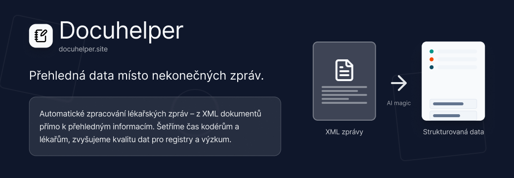

# Hack jak Brno 2025 - SvelteBoys

[](https://docuhelper.site/)



Řešení úlohy #2 z hackathonu [Hack jak Brno 2025](https://www.hackjakbrno.cz) od týmu svelte boys

Mrkněte se sami: [https://docuhelper.site/](https://docuhelper.site/)


### Jaký problém řešíme?
Lékařské zprávy jsou dlouhé texty (XML/PDF), ze kterých musí dokumentátoři a lékaři ručně lovit klíčová data – je to pomalé, nepřehledné a chybové. Zjednodušme jim práci.

### Jaké je naše řešení?
Automatické zpracování lékařských zpráv – z XML dokumentů přímo k přehledným informacím. Šetříme čas kodérům a lékařům, zvyšujeme kvalitu dat pro registry a výzkum.

### Dopady našeho řešení
Docuhelper ušetří čas tím, že automaticky načte XML se zprávami, pomocí AI z nich vytáhne uživatelem zvolená klíčová klinická data a zobrazí je v přehledné podobě. Kodér ani lékař už nemusí číst každou zprávu celou a ručně přepisovat údaje – jen rychle zkontroluje návrh a doplní, co je potřeba.

### Co jsme vytvořili během hackathonu?
Během hackathonu vznikl funkční prototyp aplikace, který umožňuje otestovat klíčové funkce zpracování dokumentace pomocí umělé inteligence. Testovací prostředí je dostupné na https://docuhelper.site a kód je k nahlédnutí na https://github.com/jakubsrnka/hack-jak-brno-2025

### Co jsme použili za technologie?
Používáme javascriptový framework SvelteKit a databázi PocketBase.

### Jaká je proveditelnost?
Aplikace běží jako prototyp v produkčním prostředí. Pro spuštění do produkce v praxi je potřeba zajistit compliance a potřebnými zákony a napojení na nemocniční informační systémy. Bez těchto požadavků je aplikace hotová k testovacímu využití nyní na https://docuhelper.site

### V čem je naše řešení nové?
V tuto chvíli probíhá veškeré zpracování dokumentace ručně. Naše aplikace umožňuje vytěžování klíčových dat z této dokumentace tak, aby kodéři ušetřili čas. Jelikož je ale potřeba zachovat kvalitu a lidský faktor, uživatelské prostředí umožňuje jednoduše zjistit, odkud AI chtěné klíčové informace čerpala.

### Co bude následovat a čeho chceme dosáhnout?
Ocenili bychom zpětnou vazbu přímo od zadavatelů naší kategorie a uživatelské testování prototypu přímo s kodéry, abychom se mohli rozhodnout, zdali má smysl ve vývoji pokračovat dále. Rádi se budeme podílet spolu s Masarykovým onkologickým ústavem na převedení aplikace do praxe.

## Boring stuff

### Development

```bash
pnpm install
```

```bash
pnpm dev
```

### DB

Using selfhosted pocketbase.

### Hosting

Project is running on vercel.
